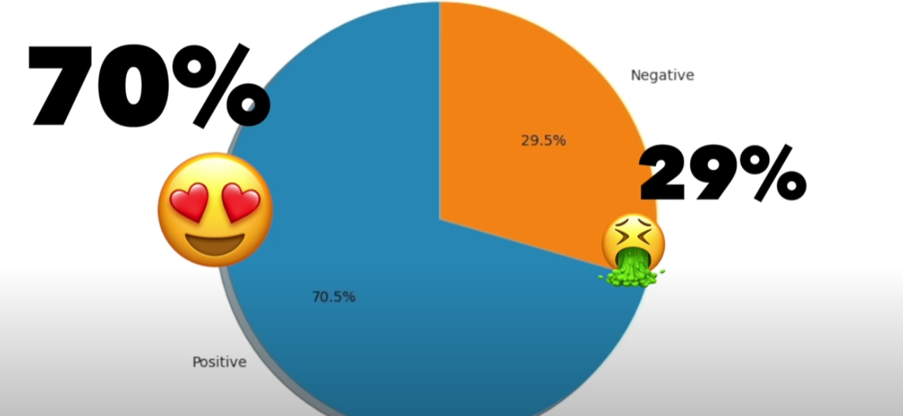
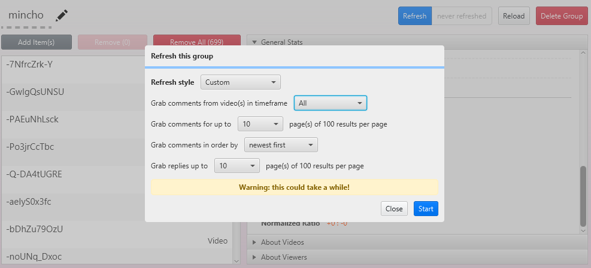
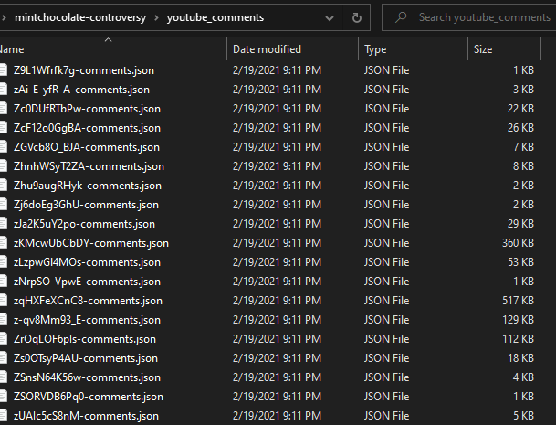

# 🌿🍫 민트초콜릿 가설검증
인터넷은 민트초콜릿을 다들 좋아하는 걸까?

# ✨ 동기

[YouTube: Twitter Sentiment Analysis on #HawaiianPizza](https://www.youtube.com/watch?v=QTgRNer2epE)

## 동기가 된 영상의 주장



- 트위터에서 크롤링한 데이터에서 민트초콜릿에 대해 감정분석을 해보니 감정의 극성이 70%가 긍정적으로 나타났다. 민트초코를 좋아하는 사람이 싫어하는 사람보다 많을 것이다.

# 🧐 검증이 필요한 가설
## 커뮤니티의 편향: 트위터의 데이터만 수집해도 괜찮을까?

Q. 트위터에 특정 인구통계 집단이 밀집되어 있고, 그들이 민트초코를 선호하는 방향으로 편향됐나?

### YouTube의 코멘트 데이터를 분석해보자! 

* 대상: "제목" 기준으로 정렬된 "mint chocolate" 키워드 검색 노출 영상 699개의 코멘트 데이터 106305건
* 수집 방법: [Youtube Comment Suite](https://github.com/mattwright324/youtube-comment-suite)
* 데이터셋: 개인정보 보호를 위해서 별도 업로드는 하지 않음


* 코멘트 수집 설정


* 수집된 코멘트 json 파일들

### Youtube 코멘트 데이터 초간단 전처리 & TextBlob 초간단 감정분석
```python
# src/analyze_youtube_comments.py
import os
import re
import json
import glob
import numpy as np
from textblob import TextBlob


def preprocess_youtube_comments(comments_dir):
    json_filenames = glob.glob(os.path.join(comments_dir, "*.json"))
    every_comments = []
    for json_filename in json_filenames:
        with open(json_filename, "r", encoding="utf-8") as comment_json:
            every_comments.extend(json.load(comment_json))
    text_only_list = [comment["commentText"] for comment in every_comments if isinstance(comment, dict)]
    return list(map(lambda string: re.sub('[^A-Za-z0-9]+', ' ', string), text_only_list))


def analyze_sentiments(sentences):
    # The polarity score is a float within the range [-1.0, 1.0]
    # -1.0 will be very negative and 1.0 will be very positive
    polarity = []
    for sentence in sentences:
        # scale polarity from [-1.0, 1.0] to [0~1]
        normalized_polarity = (TextBlob(sentence).sentiment.polarity + 1) / 2
        polarity.append(normalized_polarity)
    return np.average(polarity)


if __name__ == "__main__":
    percentile_result = analyze_sentiments(preprocess_youtube_comments("./youtube_comments/")) * 100
    print("민트초코 호: %s 불호: %s" % (percentile_result, 100 - percentile_result))

>>> 민트초코 호: 56.325168850246556 불호: 43.674831149753444z
```

YouTube 데이터를 분석해본 결과, 트위터 데이터의 분석 결과보다 더 낮은 민트초코 '호' 성향이 나타났다. 왜일까?  
확인해 본 결과, TextBlob 라이브러리는 분석하지 못한 문장에 대한 polarity를 `[-1.0, 1.0]`사이에서 `0.0`으로 나타내며, 이를 배제한 결과는 다음과 같았다.

```python
...
        normalized_polarity = (TextBlob(sentence).sentiment.polarity + 1) / 2
        # remove unanalyzed neutral results
        if normalized_polarity != 0.5:
            polarity.append(normalized_polarity)
    return np.average(polarity)


if __name__ == "__main__":
    percentile_result = analyze_sentiments(preprocess_youtube_comments("./youtube_comments/")) * 100
    print("민트초코 호: %s 불호: %s" % (percentile_result, 100 - percentile_result))

>>> 민트초코 호: 65.47127481248616 불호: 34.52872518751384
```

* polarity가 `0.0`인 데이터를 배제한 경우, 전체 샘플 수는 106305개에서 43461개로 줄어든다.

## 화자의 편향: 좋아하는 사람 (혹은 싫어하는 사람)이 더 많이 표현하나?

1. 싫어하는 사람은 관심이 없으니 대화에 참여하지 않는다고 볼 수 있을까?
* 다른 논란이 되는 음식 (고수 cilantro, 건포도 raisin)에 대해 온라인 극성이 얼마나 갈리는지 알아봐서 참조하자

2. 좋아하는, 또는 싫어하는 사람 (동일 인물)이 동일한 감정을 여러번 표출해서 편향이 생기지 않을까?
* 화자의 정보를 함께 수집해 동일한 화자의 의견은 한 번만 분석에 반영해보자

## 확증편향 또는 연구자 편향: 연구자 생각이 결과에 반영된 거 아닌가?

1. 분석의 동기가 된 영상의 유튜버는 '민트초코와 파인애플 피자 모두 맛있다'고 답했다.
2. 저장소를 생성한 사람은 '조리된 파인애플, 민트초코, 고수, 건포도'등을 모두 좋아한다.
* 앞서 살펴본 'YouTube 데이터 분석'에서 연구자는 민트초코의 '호'가 56이 나온 결과를 확인하고 '값이 너무 낮은 것 같다' 라는 가설을 즉시 세우고, 추가 분석을 진행했다.
* 또 YouTube 영상의 경우, 특정 채널의 가장 강력한 시청자 층인 '구독자'는 컨텐츠와 상관없이 '유튜버'에게 호의를 가지고 있을 가능성이 있어 데이터가 긍정에 가깝게 편향될 수 있다.
